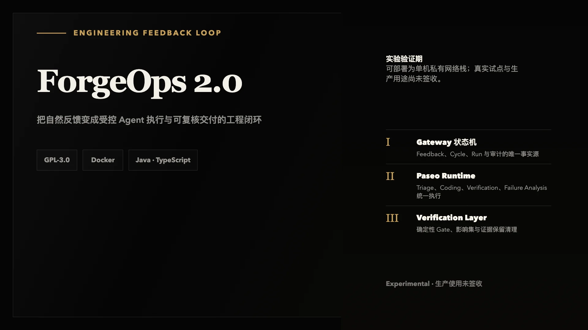

<div align="center">

# ForgeOps 2.0

**把自然反馈变成受控 Agent 执行与可复核交付的工程闭环**



[](./LICENSE)


</div>

---

## 这是什么

ForgeOps 2.0 是一个受控的工程反馈闭环：反馈经 Gateway 脱敏和持久化后，由 ForgeOps 自己的状态机驱动 Paseo Runtime 执行 Triage / Coding / Verification。Coding Agent 的终点是待验证的 Draft PR；合并前必须过 PR 门禁，确定性 Gate 在满足 ADR-0005 全部条件时可机器 Merge，生产部署与最终验收仍必须人工。

当前处于实验验证期，尚未完成真实试点与自然反馈价值样本，不能作为发布级平台或生产自动化使用。

## 为什么需要它

把一条自然反馈变成一次可信的修复，卡点通常不在写代码，而在链路上的不确定性：上下文要人工整理，Agent 的行为边界不可控，AI 的自我结论不能直接采信，交付与验证证据散落各处、无法回溯。

ForgeOps 2.0 把这段链路收进一个有状态机、有确定性门禁、有全链审计的实验平台：可重试、可审计，且默认不信任任何未经独立核验的声明。

## 你会得到什么


## 边界与运行方式

```text
Feedback SDK / Host identity
          │
          ▼
ForgeOps Gateway ──service credential──► forgeops-paseo-runtime ──► Paseo daemon
      │                                             ├─ Triage / Coding：每 Run 独立 Worktree 与分支
      │                                             └─ Verification / Failure Analysis：只读任务目录（ADR-0013）
      ├──受控调度──► 隔离执行器 / 一次性验证栈（ADR-0004/0008，Docker 隔离：内部网络、只读 rootfs、镜像白名单）
      ├─ PostgreSQL: Feedback / Cycle / Context / Run / Inbox / Outbox / Verification(plan/run/evidence/node/edge)
      └─ Git/CI/Deploy evidence（GitHub Webhook 边界已实现；真实试点接入待 Owner 指定）
```

- Gateway 是状态机、重试和审计的唯一事实源；2.0 默认只通过 Paseo 执行 Triage、Coding、Verification 和 Failure Analysis；隔离执行器只负责运行受控测试，不是状态源。
- Runtime 只提供内部的 `submit`、`inspect`、`cancel`，默认只绑定 loopback。
- 浏览器不能传入 Agent Provider、工作目录、权限、超时或输出 Schema。
- Triage/Coding 输出必须满足代码固定的 JSON Schema；Coding 声称的 PR/Commit 不能直接推进为 `PR_READY`。
- 合并前必经 PR 门禁（`PR_READY → VERIFY_RUNNING → GATE_PASS`，ADR-0002/0005）；确定性 Gate 满足 ADR-0005 全部条件时可机器 Merge。
- Multica 保留为独立的人机工作管理面，不进入 2.0 P0 主链；如后续证明存在 Paseo 无法满足的硬需求，只能按 ADR-0013 的准入门槛以影子/可选 Adapter 重新评审。

## 快速开始

```bash
# 1) 构建镜像（仓库根目录）
docker build -t forgeops-gateway:v2 -f gateway/forgeops-gateway/Dockerfile .
docker build -t forgeops-runtime:v2  -f runtime/forgeops-paseo-runtime/Dockerfile .

# 2) 准备部署参数与试点注册（全部秘密由部署环境提供，缺失即显式失败）
cd deploy/docker-compose
cp forgeops-v2.env.example forgeops-v2.env        # 填写数据库、令牌、Paseo daemon 地址
mkdir -p registry-v2 workspace/<repo>             # 试点仓库克隆 + 项目注册 YAML

# 3) 启动并健康检查
docker compose -f forgeops-v2.yml --env-file forgeops-v2.env up -d
curl -s http://127.0.0.1:18093/actuator/health    # 期望 {"status":"UP"}
```

完整落地步骤（env/registry/workspace 说明、Paseo daemon 安装、健康验证、运维与回滚）见 [2.0 部署指南](docs/deployment-v2.md)。daemon 不可达时反馈仍可提交，Agent Run 排队（`PASEO_UNAVAILABLE`），恢复后按幂等 key 找回既有 agent，不重复创建。

## 运行前提

Gateway 必须由部署环境提供：独立 PostgreSQL 连接、`FORGEOPS_V2_REGISTRY_PATH`、`FORGEOPS_V2_REGISTRY_WORKSPACE_ROOT`、`FORGEOPS_V2_SECURITY_TOKEN_SECRET`、`FORGEOPS_RUNTIME_URL` 和 `FORGEOPS_RUNTIME_SERVICE_TOKEN`。没有 Runtime 地址或服务凭证时 Gateway 应拒绝启动。

GitHub 交付证据默认关闭。启用后必须同时提供 `FORGEOPS_V2_GITHUB_ENABLED=true`、`FORGEOPS_V2_GITHUB_WEBHOOK_SECRET` 和最小只读权限的 `FORGEOPS_V2_GITHUB_API_TOKEN`；每个 v2 项目声明准确的 `github.repository`、`github.baseBranch`、`github.allowedMergeLogins`、唯一的 `github.requiredCheckName` 与非生产 `github.testEnvironment`。Webhook 入口为 `POST /integrations/github`，只接受 `X-Hub-Signature-256` 校验后的字节；Agent 报告的 PR 还会被 GitHub REST 查询独立比对。

Runtime 必须由部署环境提供：`FORGEOPS_RUNTIME_SERVICE_TOKEN`、`FORGEOPS_RUNTIME_DATA_FILE`、`FORGEOPS_RUNTIME_ALLOWED_ROOTS`；可配置 `FORGEOPS_RUNTIME_RUN_TIMEOUT_MS`（默认 15 分钟）和 `FORGEOPS_RUNTIME_MAX_CONCURRENT_PER_PROJECT`（默认 1）。它不会持久化 Prompt、Context 或 Agent 输出。

真实 Git/CI/测试部署接入、最小权限凭证和两个试点仓库均需 Owner 明确指定后才能进行，详见验收清单的 `S-06`、`DEL-*`、`OPS-*` 与 `VAL-*`。

## 本地质量检查与验证脚本

```bash
# TypeScript 工作区（runtime + sdk + 示例）
pnpm -r typecheck && pnpm -r test

# Gateway 全量：单元（surefire）+ PostgreSQL 集成（failsafe，需隔离 forgeops_v2 库）
cd gateway/forgeops-gateway
FORGEOPS_DB_URL=jdbc:postgresql://127.0.0.1:15432/forgeops_v2_probe \
FORGEOPS_DB_USER=forgeops_probe \
FORGEOPS_DB_PASSWORD='<isolated password>' \
mvn verify
```

PostgreSQL 集成测试（`*PostgresIT`）在 `mvn verify` 的 failsafe 阶段执行，必须显式提供一个空的、隔离的 `forgeops_v2` 数据库；没有数据库时构建失败而不是跳过。`DockerVerificationExecutorIT` 需要本机 Docker 并会真实创建/销毁一次性验证栈。

四个统一验证入口（缺外部系统时显式 SKIPPED 并以非 0 退出，不计入通过）：

```bash
scripts/verify-v2-e2e.sh        # 完整闭环：mvn verify + pnpm + compose 校验 + 真实进程 API 旅程
scripts/verify-v2-recovery.sh   # 故障注入：PG 中断、Gateway kill -9、Runtime 重启
scripts/verify-v2-security.sh   # 安全：无默认秘密、Webhook 签名/重放、日志无秘密、私网暴露
scripts/verify-v2-paseo-real.sh # 真实 daemon 通道：同 key 并发幂等、取消、断连恢复（无 daemon→3）
```

## 当前验证状态

当前验收进度：106 PASS / 29 ENV_BLOCKED / 4 MANUAL_PENDING（逐项状态见[验收清单](docs/forgeops-2.0-acceptance-checklist.md)，执行记录见[实测证据](docs/evidence/v2.0/README.md)）。

- 已实际验证（隔离 PostgreSQL + 真实 Docker + 真实进程）：新数据库模型与迁移（V1–V5）、Inbox/Outbox、项目/身份隔离、Paseo Runtime 契约（submit/inspect/cancel、幂等、超时、排队、daemon 离线排队恢复）、每 Coding Run 独立 Worktree、验证层核心（VER-01/02/03/04/05/06/07/08/10/11/12/13/16/17/18/19/20/21/22/23/24/25/27/28：门禁状态机、确定性 Gate、图谱影响集与保守回退、一次性 Docker 验证栈、种子确定性、召回断路器、Planner 确定性回退、证据保留清理；VER-05/06 已在真实 Paseo daemon 通道复验）。
- 未签收（需要真实外部系统或 Owner 决策）：真实 GitHub PR/CI/部署链（DEL-01～09 真实部分、VER-09/14/15/26 真实通道）、真实 Paseo daemon 上以全部四种角色跑通完整闭环、两个真实试点与 20–30 条自然反馈（VAL-*）、Go/Pivot/Stop 决议。

## 文档

- [2.0 部署指南](docs/deployment-v2.md) — 镜像构建、环境变量、daemon、验证矩阵、运维、回滚与安全清单
- [2.0 实施计划](docs/forgeops-2.0-implementation-plan.md)
- [2.0 验收清单](docs/forgeops-2.0-acceptance-checklist.md)
- [架构决策记录（ADR）](docs/adr/README.md) — 验证层并入后的决议修订与设计定稿
- [现有实测证据](docs/evidence/v2.0/README.md)

V0.1 架构、验收与接入说明仅作历史材料，不是 2.0 的部署或接口说明：

- [V0.1 架构](forgeops-architecture-v0.1.md) · [V0.1 验收记录](ACCEPTANCE.md) · [V0.1 接入说明](docs/integration-guide.md)

## 许可证

[GPL-3.0](./LICENSE)

## 关于作者

[@wuxiy](https://github.com/wuxiy)
